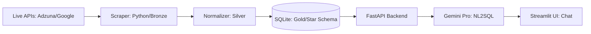

# 🧭 MarketScout: Generative BI & Market Intelligence System

> **Two inputs. One question. Real answers.**  
> Point MarketScout at a city and industry, and it fetches live market signals, builds a scored opportunity map, and lets you interrogate the data in plain English — all the way from raw API calls to a conversational AI interface.

---

## System Architecture



### Medallion Architecture

The pipeline is structured in three discrete quality layers — the same pattern used in production Databricks and dbt workflows, here implemented as a self-contained Python system runnable in a single command.

| Layer | Module | What happens |
|-------|--------|-------------|
| 🥉 **Bronze** | `scout/headlines.py`, `scout/providers/` | Raw bytes from Adzuna Jobs API and Google News RSS. No transformation. Disk-cached with TTL for resilience. Per-source `fetch_status` recorded (`live \| cached \| failed`). |
| 🥈 **Silver** | `normalize.py`, `brain/strategy.py` | Deduplication by title hash. City/industry normalisation. Keyword → bottleneck tag mapping. Pydantic v2 schema validation. Explainable `score_breakdown` computed (`signal_frequency + source_diversity + job_role_density = 1.0`). |
| 🥇 **Gold** | SQLite via `SQLAlchemy` | Structured star schema written after every run. Queryable by the NL2SQL layer. Never modified by the AI — only the pipeline writes to it. |

### Security Layer

The AI query interface enforces two independent read-only guarantees:

```
User question
     │
     ▼
LangChain SQL chain  ──────────────────────────────────────────────────────┐
     │                                                                      │
     ▼                                                                      │
Keyword guard: DROP / DELETE / UPDATE / INSERT → HTTP 400 immediately      │
     │                                                                      │
     ▼                                                                      │
SQLite opened with  sqlite3.connect("file:path?mode=ro", uri=True)         │
     │          ← SQLAlchemy engine uses a custom creator function ─────────┘
     ▼
Raw results → Gemini synthesis prompt → plain-English insight
```

1. **Structural lock** — the SQLite connection is opened in `?mode=ro` URI mode. The OS-level file flag makes write operations impossible regardless of what SQL is executed; the database cannot be mutated even if the safety check were somehow bypassed.
2. **Keyword guard** — before any execution, the generated SQL is scanned for `DROP`, `DELETE`, `UPDATE`, and `INSERT`. A match returns HTTP 400 immediately without touching the database.

Both layers are independently tested in `tests/test_api.py`.

---

## BI Capabilities

MarketScout is built as a queryable business intelligence system, not just a report generator. Once the pipeline runs, the Gold layer is a fully relational SQLite database that supports the same analytical patterns used in production BI stacks.

### Star Schema Design

The database is modelled around a central `opportunities` fact table with dimension tables for `runs`, `signals`, and `leads`:

```
         ┌─────────┐
         │  runs   │  ← city, industry, strategy_mode, coverage_score
         └────┬────┘
              │  1:N
         ┌────▼──────────┐
         │ opportunities │  ← title, pain_score, roi_signal, confidence,
         │   (FACT)      │    ai_category, support_level, recommendation,
         └──┬────────┬───┘    is_padded, trend_key
            │        │
          1:N      1:N
     ┌─────▼──┐  ┌──▼──────┐
     │ signals│  │  leads  │  ← company, job_count, readiness_score
     └────────┘  └─────────┘
      (headline/job rows with provider, link, title)
```

This structure enables queries across multiple dimensions without denormalisation — the same schema pattern used in Kimball-style data warehouses.

### Multi-table Joins

Because the Gold layer is a proper relational schema, the NL2SQL engine can answer questions that span tables:

| Question type | Tables joined |
|---|---|
| "Which industries had the most high-confidence opportunities this week?" | `runs` ⟶ `opportunities` |
| "Show me companies hiring in sectors with pain scores above 7" | `opportunities` ⟶ `signals` ⟶ `leads` |
| "What is the average coverage score for Construction vs Retail?" | `runs` ⟶ `opportunities` |
| "List all headline sources that contributed to top-ranked opportunities" | `opportunities` ⟶ `signals` |

LangChain's `create_sql_query_chain` passes the schema (with 3 sample rows per table) to Gemini so it can construct correct multi-table joins without hallucinating column names.

### Automated Executive Synthesis

The pipeline runs two separate LLM calls for every user question — a deliberate separation of concerns:

1. **SQL generation call** — Gemini receives the schema and the user's question; outputs only structured SQL. Temperature is set to 0 for deterministic, reproducible queries.
2. **Synthesis call** — the raw result rows and the original question are passed to a second Gemini call with the prompt: *"Synthesize these data rows into a clear, one-paragraph business insight for a product manager."* This call is free to use natural language and context.

Separating structure from narrative means each step is independently debuggable: you can inspect the SQL in the `View generated SQL` expander, then evaluate whether the insight accurately reflects the data.

---

## What makes this a portfolio project

- **End-to-end data pipeline** — raw API bytes → normalised schema → queryable warehouse → AI-generated insight, all in one codebase.
- **Explainable scoring** — every opportunity carries `score_breakdown: {signal_frequency, source_diversity, job_role_density}` summing to 1.0. Rankings are decomposable, not black-box.
- **Evidence integrity gate** — `marketscout eval` cross-checks every `evidence.link` in `strategy.json` against `input_signals.json`. If any link is hallucinated, the gate exits 1 and blocks the report.
- **Read-only AI SQL** — the NL2SQL layer opens the SQLite database in `?mode=ro` URI mode, and a keyword guard rejects any `DROP / DELETE / UPDATE / INSERT` statement the LLM might generate.
- **Deterministic mode** — `--deterministic` seeds `random` at 42 and sorts all signals before processing. Two runs on the same inputs produce bit-identical `strategy.json` — auditable and directly comparable.
- **108 tests, zero network calls** — all HTTP fetches and LLM calls are monkeypatched; CI runs fully offline.

---

## Quickstart

### 1 — Clone and install

```bash
git clone https://github.com/your-username/marketscout.git
cd marketscout
python3 -m venv .venv && source .venv/bin/activate
pip install -r requirements.txt
pip install -e .          # makes `marketscout` available as a CLI command
```

### 2 — Configure API keys

Create a `.env` file at the project root (already gitignored):

```bash
# .env
GOOGLE_API_KEY=your_gemini_api_key
ADZUNA_APP_ID=your_adzuna_app_id
ADZUNA_APP_KEY=your_adzuna_app_key
ADZUNA_COUNTRY=ca          # optional, defaults to ca
```

Keys are loaded automatically via `python-dotenv` when the app starts. To run without Adzuna keys, add `--jobs-provider rss` to any `run` command.

### 3 — Run the pipeline

```bash
# Ingest signals, score opportunities, write all artifacts
marketscout run --city Vancouver --industry Construction --deterministic

# Validate the output (evidence integrity gate)
RUN_DIR=$(ls -td out/*/ | head -n 1)
marketscout eval \
  --signals "${RUN_DIR}input_signals.json" \
  --strategy "${RUN_DIR}strategy.json"

# Package into a shareable zip
marketscout bundle --out-dir "${RUN_DIR%/}"
```

### 4 — Start the AI chat interface

```bash
# Terminal 1 — FastAPI backend
PYTHONPATH=src uvicorn marketscout.backend.main:app --reload
# → http://localhost:8000  |  Swagger: http://localhost:8000/docs

# Terminal 2 — Streamlit frontend
streamlit run src/marketscout/frontend/app.py
# → http://localhost:8501
```

Then ask: *"Which opportunities have a pain score above 7?"*

---

## Demo scenarios

Three city/industry pairs chosen to show the pipeline across different signal profiles.

**Vancouver — Construction**


**Vancouver — Real Estate**


**Toronto — Retail**


---

## Artifacts produced per run

| File | Contents |
|------|----------|
| `input_signals.json` | Raw headlines + jobs — ground truth for all evidence links |
| `strategy.json` | v2.0 opportunity map: 5–8 items with `pain_score`, `roi_signal`, `confidence`, `score_breakdown`, `business_case`, `evidence`, `support_level`, `recommendation` |
| `signal_analysis.json` | Per-source fetch status (`live\|cached\|failed`), run metadata, keyword hits |
| `report.md` / `report.html` | Narrative report: Executive Summary → Signal Analysis → Opportunity Map |
| `summary.txt` | One-page plain-text summary |
| `leads.csv` | Company-level leads: `company`, `job_count`, `readiness_score`, `example_links` |
| `eval_report.md` | Quality-gate results (written by `marketscout eval`) |

> `out/` and `.cache/` are gitignored. Run `make clean` to remove both.

---

## CLI reference

| Command | Description |
|---------|-------------|
| `run` | Fetch live signals → score opportunities → write all artifacts |
| `eval` | Quality gate: schema, evidence links, score bounds. Exit 0 = pass |
| `bundle` | Copy artifacts to `bundle/`, create shareable zip |

### `run` flags

| Flag | Default | Description |
|------|---------|-------------|
| `--city` | *(required)* | Target city (accepts `"Vancouver, BC"` → normalises to `"Vancouver"`) |
| `--industry` | *(required)* | Target industry — case-insensitive, aliases accepted (`"tech"` → Technology) |
| `--jobs-provider` | `adzuna` | `adzuna` or `rss` |
| `--refresh` | off | Force live fetch — fails hard if network unavailable |
| `--deterministic` | off | Seed 42, stable ordering — reproducible outputs |
| `--write-leads` | on | Write `leads.csv` (use `--no-write-leads` to skip) |

---

## API endpoints

| Method | Path | Description |
|--------|------|-------------|
| `GET` | `/` | Health check |
| `POST` | `/api/ask` | NL2SQL: accepts `{"user_question": "..."}`, returns `{sql_query, insights}` |

The NL2SQL endpoint rejects any statement containing `DROP`, `DELETE`, `UPDATE`, or `INSERT` (HTTP 400) and uses a read-only SQLite connection — the LLM cannot mutate data.

---

## Environment variables

| Variable | Default | Description |
|----------|---------|-------------|
| `GOOGLE_API_KEY` | — | Gemini API key (required for `/api/ask`) |
| `ADZUNA_APP_ID` | — | Adzuna App ID (required for Adzuna jobs provider) |
| `ADZUNA_APP_KEY` | — | Adzuna API key |
| `ADZUNA_COUNTRY` | `ca` | Adzuna country code |
| `MARKETSCOUT_CACHE_DIR` | `.cache/marketscout/` | Disk cache location |
| `MARKETSCOUT_DISK_CACHE_TTL` | `3600` | Cache TTL in seconds |
| `MARKETSCOUT_DB_PATH` | `.cache/marketscout/marketscout.db` | SQLite database path |

---

## Testing

```bash
make test
# or
PYTHONPATH=src python3 -m pytest tests/ -v
```

**108 tests, 1 skipped** — covering: schema validation, deterministic mode, evidence integrity, fetch status (`live/cached/failed`), NL2SQL safety gate, CLI artifact creation, eval pass/fail, bundle creation, cache TTL, provider parsing, and input normalization. All tests run without network access or API keys — every HTTP and LLM call is monkeypatched.

---

## Repo layout

```
marketscout/
├── .env                             # API keys — gitignored, never committed
├── Makefile                         # make run | make test | make clean
├── requirements.txt
├── pyproject.toml
├── assets/                          # demo screenshots
└── src/marketscout/
    ├── cli.py                       # run | eval | bundle
    ├── config.py                    # dotenv loader + env-var helpers
    ├── normalize.py                 # city + industry normalisation
    ├── cache.py                     # disk cache with TTL
    ├── leads.py                     # company-level lead scoring
    ├── backend/
    │   ├── main.py                  # FastAPI app (CORS, router mount)
    │   ├── nl2sql.py                # LangChain NL2SQL pipeline + safety gate
    │   ├── schema.py                # Pydantic v2 models (StrategyOutput, etc.)
    │   └── ai/                      # strategy generation, report renderers
    ├── scout/                       # live signal ingestion
    │   ├── headlines.py             # Google News RSS fetcher
    │   ├── jobs.py                  # jobs dispatcher (Adzuna / RSS)
    │   └── providers/               # AdzunaProvider, RssJobsProvider
    ├── frontend/
    │   └── app.py                   # Streamlit chat UI
    └── templates/
        └── industries.py            # keyword maps → opportunity templates
```

---

## Talking points

- **Medallion architecture in Python.** Bronze (raw API bytes) → Silver (normalised, deduplicated, Pydantic-validated) → Gold (SQLite star schema). The same pattern used in Databricks/dbt, but self-contained and runnable locally in one command.
- **Why a read-only AI layer matters.** Giving an LLM write access to a database is a critical security failure. The SQLite `?mode=ro` URI flag and keyword guard make it structurally impossible for the AI to mutate data — not just a best-effort check.
- **Eval gate as a CI/CD analogy.** `marketscout eval` exits 1 if any evidence link is hallucinated. This is the same principle as a failing unit test — you can't ship a report that hasn't passed the gate.
- **Deterministic mode for data engineering reproducibility.** Seeding random and sorting inputs before processing means the same raw data always produces the same output. This is the property you need to make a pipeline auditable and diff-able across runs.
- **LangChain as an orchestration layer, not magic.** `create_sql_query_chain` handles prompt construction and model calls. The second synthesis prompt is a deliberate separation of concerns: one call for structured output (SQL), a second for unstructured output (insight) — cleaner and more debuggable than a single mega-prompt.

---

## License

MIT. See [LICENSE](LICENSE).
